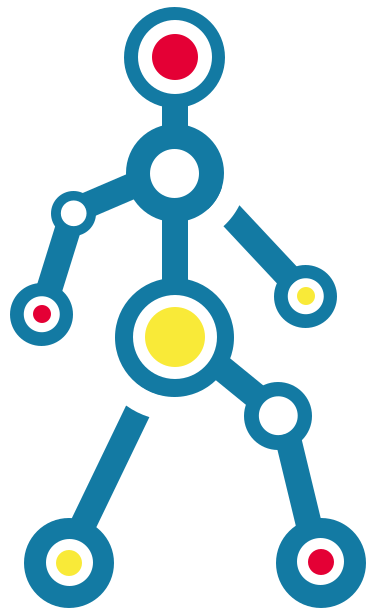

# IduEdu

[](https://github.com/psf/black)
[](https://pypi.org/project/iduedu/)
[](https://github.com/DDonnyy/IduEdu/actions/workflows/ci_pipeline.yml)
[](https://codecov.io/gh/DDonnyy/IduEdu)
[](https://opensource.org/licenses/MIT)
[](https://iduclub.github.io/IduEdu/)

<p align="center">



</p>

**IduEdu** is an open‑source Python toolkit for building and analyzing **multi‑modal city networks** from **OpenStreetMap** data.  
It downloads OSM data via **Overpass**, constructs **drive**, **walk**, and **public transport** graphs, and can **join them into an intermodal network**.
The package also includes fast matrix tools to compute large origin–destination matrices.

##  [**Documentation**](https://iduclub.github.io/IduEdu/)

---

## Features

- **Graph Builders**
  - `get_drive_graph` — driving network with speeds & categories
  - `get_walk_graph` — pedestrian network (bi‑directional)
  - `get_all_public_transport_graph` / `get_single_public_transport_graph` — bus, tram, trolleybus, subway
  - `get_intermodal_graph` — compose PT + walk with platform snapping
- **Geometry & CRS Correctness**
  - Local UTM estimation for accurate metric lengths
  - Safe graph ↔ GeoDataFrame conversion; optional geometry restoration
- **Matrices**
  - `get_adj_matrix_gdf_to_gdf` — OD matrices by length/time using Numba accelerated Dijkstra
  - `get_closest_nodes` — nearest node snapping
- **Utilities**
  - `clip_nx_graph`, `reproject_graph`, `read_gml`/`write_gml`, etc.

---

## Installation

```bash
pip install iduedu
```

> Requires Python 3.10+ and common geospatial stack (GeoPandas, Shapely, PyProj, NetworkX, NumPy, Pandas).

---

## Quickstart

### 1) Build an intermodal graph

```python

from iduedu import get_intermodal_graph

# Define a territory (use OSM relation id or a shapely polygon/geodataframe)
G = get_intermodal_graph(osm_id=1114252)  # e.g., Saint Petersburg, Vasileostrovsky District

```

### 2) Compute an OD matrix (time or length)

```python
import geopandas as gpd
from iduedu import get_adj_matrix_gdf_to_gdf

# origins/destinations can be any geometries; representative points are used
origins = gpd.GeoDataFrame(geometry=[...], crs=...)
destinations = gpd.GeoDataFrame(geometry=[...], crs=...)

M = get_adj_matrix_gdf_to_gdf(
    origins, destinations, G, weight="time_min", dtype="float32", threshold=None
)
print(M.head())

```

---

## Configuration

Tweak Overpass endpoint, timeouts, and rate limits globally:

```python
from iduedu import config

config.set_overpass_url("https://overpass-api.de/api/interpreter")
config.set_timeout(120)
config.set_rate_limit(min_interval=1.0, max_retries=3, backoff_base=0.5)

# Optional progress bars and logging
config.set_enable_tqdm(True)
config.configure_logging(level="INFO")
```
### Historical snapshots

You can fix queries to a specific OSM snapshot using the Overpass `date` parameter.
This allows retrieving map data as it existed at a given moment in time.
```python
# Specific day
config.set_overpass_date(date="2020-01-01")

# Or build from components
config.set_overpass_date(year=2020)            # → 2020-01-01T00:00:00Z
config.set_overpass_date(year=2020, month=5)   # → 2020-05-01T00:00:00Z
```
To reset and use the latest data again:
```python
config.set_overpass_date()  # or config.set_overpass_date(None)
```

>When a historical date is set, complex subway stop-area relations are skipped automatically
> (as Overpass may not support those at arbitrary timestamps). A warning is logged in such cases.

> IduEdu respects Overpass API etiquette. Please keep sensible rate limits.


---

## Roadmap / Ideas

- More PT modes and GTFS import
- Caching of Overpass responses
- Richer edge attributes (e.g., elevation, turn costs)

> Contributions and ideas are welcome! Please open an issue or PR.

---

## Contacts

- [NCCR](https://actcognitive.org/) - National Center for Cognitive Research
- [IDU](https://idu.itmo.ru/) - Institute of Design and Urban Studies
- [Natalya Chichkova](https://t.me/nancy_nat) - project manager
- [Danila Oleynikov (Donny)](https://t.me/ddonny_dd) - lead software engineer
---

## Acknowledgments

Реализовано при финансовой поддержке Фонда поддержки проектов Национальной технологической инициативы в рамках реализации "дорожной карты" развития высокотехнологичного направления "Искусственный интеллект" на период до 2030 года (Договор № 70-2021-00187)

This research is financially supported by the Foundation for National Technology Initiative's Projects Support as a part of the roadmap implementation for the development of the high-tech field of Artificial Intelligence for the period up to 2030 (agreement 70-2021-00187)

---

## License

This project is open‑source. See the [LICENSE](LICENSE.txt) file for details.

---

## Publications

_Coming soon..._