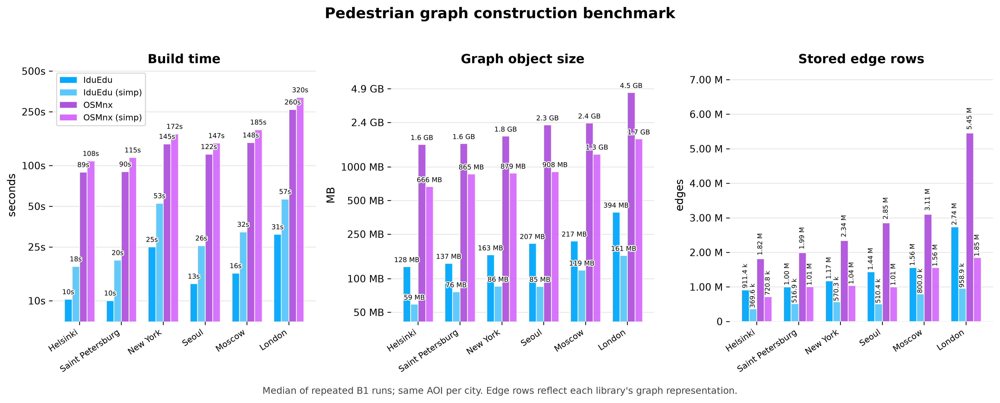

# Benchmarks and Design Notes

IduEdu is designed as a single Python pipeline for city-network analysis: OpenStreetMap extraction,
graph construction, public-transport integration and large origin-destination computations all use the
same `UrbanGraph` data model. The 2026 paper benchmark suite in `paper2026/` measures those stages from
raw CSV outputs, with repeated runs and median values.

The numbers below are not a general ranking of geospatial libraries. OSMnx remains a mature and widely
used toolkit for street-network analysis. This comparison isolates one common workload: pedestrian graph
construction from the same city-scale AOIs, using both `simplify=False` and `simplify=True` in IduEdu and
OSMnx.

## What IduEdu Adds

- `UrbanGraph`: a tabular graph representation backed by `GeoDataFrame` node and edge tables.
- Lazy CSR adjacency built directly from edge tables and reused by shortest-path routines.
- Street-graph builders for drive and walk networks from OSM with metric projection and optional simplification.
- Static public-transport graph construction directly from OSM relations, without requiring GTFS.
- Intermodal graph construction by projecting stops, platforms and subway access points onto the walking graph.
- OD-matrix computation on Numba-backed CSR kernels with cutoff thresholds and adaptive graph reversal.
- Optional NetworkX adapters for interoperability without using NetworkX as the internal graph representation.

## Pedestrian Graph Construction

Benchmark B1 compares graph construction time, stored edge rows and a deterministic object-size estimate
for the final in-memory geospatial graph representation. For IduEdu, the estimate covers `UrbanGraph`
node and edge `GeoDataFrame` tables plus Shapely geometry coordinate buffers. For OSMnx, the estimate
covers the returned `networkx.MultiDiGraph` dictionaries, attributes, geometry and coordinate buffers.
It is not peak process RSS during construction.

Without simplification, IduEdu's time ratio is highest in this workload: OSMnx takes **5.8-9.3x** longer
across the tested cities, with a median ratio of **8.9x**. With simplification enabled, the ratio is
**3.3-6.0x** with a median of **5.7x**. In both modes, the final graph representation has a roughly
**10-12x** lower deterministic object-size estimate.

Rows are lightly shaded by simplify mode. Ratios are `OSMnx / IduEdu`.

<table>
  <thead>
    <tr>
      <th rowspan="2">Simplify</th>
      <th rowspan="2">City</th>
      <th colspan="3">Build time</th>
      <th colspan="3">Graph object size</th>
      <th colspan="2">Stored edge rows</th>
    </tr>
    <tr>
      <th>IduEdu</th>
      <th>OSMnx</th>
      <th>Ratio</th>
      <th>IduEdu</th>
      <th>OSMnx</th>
      <th>Ratio</th>
      <th>IduEdu</th>
      <th>OSMnx</th>
    </tr>
  </thead>
  <tbody>
    <tr style="background: #f1faff;">
      <td rowspan="6"><strong>false</strong></td>
      <td>Helsinki</td>
      <td align="right">10.3 s</td>
      <td align="right">89.5 s</td>
      <td align="right"><strong>8.7x</strong></td>
      <td align="right">128 MB</td>
      <td align="right">1.6 GB</td>
      <td align="right"><strong>12.4x</strong></td>
      <td align="right">911.4k</td>
      <td align="right">1.82M</td>
    </tr>
    <tr style="background: #f1faff;">
      <td>Saint Petersburg</td>
      <td align="right">10.0 s</td>
      <td align="right">90.3 s</td>
      <td align="right"><strong>9.0x</strong></td>
      <td align="right">137 MB</td>
      <td align="right">1.6 GB</td>
      <td align="right"><strong>11.8x</strong></td>
      <td align="right">1.00M</td>
      <td align="right">1.99M</td>
    </tr>
    <tr style="background: #f1faff;">
      <td>New York</td>
      <td align="right">25.0 s</td>
      <td align="right">144.6 s</td>
      <td align="right"><strong>5.8x</strong></td>
      <td align="right">163 MB</td>
      <td align="right">1.8 GB</td>
      <td align="right"><strong>11.6x</strong></td>
      <td align="right">1.17M</td>
      <td align="right">2.34M</td>
    </tr>
    <tr style="background: #f1faff;">
      <td>Seoul</td>
      <td align="right">13.4 s</td>
      <td align="right">121.6 s</td>
      <td align="right"><strong>9.1x</strong></td>
      <td align="right">207 MB</td>
      <td align="right">2.3 GB</td>
      <td align="right"><strong>11.5x</strong></td>
      <td align="right">1.44M</td>
      <td align="right">2.85M</td>
    </tr>
    <tr style="background: #f1faff;">
      <td>Moscow</td>
      <td align="right">16.0 s</td>
      <td align="right">148.1 s</td>
      <td align="right"><strong>9.3x</strong></td>
      <td align="right">217 MB</td>
      <td align="right">2.4 GB</td>
      <td align="right"><strong>11.4x</strong></td>
      <td align="right">1.56M</td>
      <td align="right">3.11M</td>
    </tr>
    <tr style="background: #f1faff;">
      <td>London</td>
      <td align="right">31.0 s</td>
      <td align="right">259.8 s</td>
      <td align="right"><strong>8.4x</strong></td>
      <td align="right">394 MB</td>
      <td align="right">4.5 GB</td>
      <td align="right"><strong>11.8x</strong></td>
      <td align="right">2.74M</td>
      <td align="right">5.45M</td>
    </tr>
    <tr style="background: #fbf6ff;">
      <td rowspan="6"><strong>true</strong></td>
      <td>Helsinki</td>
      <td align="right">18.0 s</td>
      <td align="right">108.2 s</td>
      <td align="right"><strong>6.0x</strong></td>
      <td align="right">59 MB</td>
      <td align="right">666 MB</td>
      <td align="right"><strong>11.3x</strong></td>
      <td align="right">369.6k</td>
      <td align="right">720.8k</td>
    </tr>
    <tr style="background: #fbf6ff;">
      <td>Saint Petersburg</td>
      <td align="right">20.0 s</td>
      <td align="right">114.7 s</td>
      <td align="right"><strong>5.7x</strong></td>
      <td align="right">76 MB</td>
      <td align="right">865 MB</td>
      <td align="right"><strong>11.3x</strong></td>
      <td align="right">516.9k</td>
      <td align="right">1.01M</td>
    </tr>
    <tr style="background: #fbf6ff;">
      <td>New York</td>
      <td align="right">52.6 s</td>
      <td align="right">171.6 s</td>
      <td align="right"><strong>3.3x</strong></td>
      <td align="right">86 MB</td>
      <td align="right">879 MB</td>
      <td align="right"><strong>10.3x</strong></td>
      <td align="right">570.3k</td>
      <td align="right">1.04M</td>
    </tr>
    <tr style="background: #fbf6ff;">
      <td>Seoul</td>
      <td align="right">25.6 s</td>
      <td align="right">146.7 s</td>
      <td align="right"><strong>5.7x</strong></td>
      <td align="right">85 MB</td>
      <td align="right">908 MB</td>
      <td align="right"><strong>10.6x</strong></td>
      <td align="right">510.4k</td>
      <td align="right">1.01M</td>
    </tr>
    <tr style="background: #fbf6ff;">
      <td>Moscow</td>
      <td align="right">32.4 s</td>
      <td align="right">184.5 s</td>
      <td align="right"><strong>5.7x</strong></td>
      <td align="right">119 MB</td>
      <td align="right">1.3 GB</td>
      <td align="right"><strong>10.9x</strong></td>
      <td align="right">800.0k</td>
      <td align="right">1.56M</td>
    </tr>
    <tr style="background: #fbf6ff;">
      <td>London</td>
      <td align="right">56.6 s</td>
      <td align="right">319.7 s</td>
      <td align="right"><strong>5.6x</strong></td>
      <td align="right">161 MB</td>
      <td align="right">1.7 GB</td>
      <td align="right"><strong>11.0x</strong></td>
      <td align="right">958.9k</td>
      <td align="right">1.85M</td>
    </tr>
  </tbody>
</table>

Edge counts should be read as stored edge rows in each representation, not as an independent quality
metric. `UrbanGraph` can encode bidirectional pedestrian edges with one row and an edge-direction column,
while a directed multigraph representation commonly stores separate directed edge rows.

## Protocol

All B1 measurements use the same area of interest per city. The benchmark suite downloads PBF files,
extracts the PBF bounding box and uses that bounding box as the AOI for each library. Every measurement is
repeated at least three times, and the documentation reports medians.

Environment recorded for the B1 run:

- CPU class: Intel Core i7-12700F workstation, 64 GB RAM.
- Platform: Windows 10 / Windows 11 family.
- Python: 3.11.9.
- IduEdu: 2.0.0.
- OSMnx: 2.1.0.
- NetworkX: 3.6.1.
- GeoPandas: 1.1.4.
- Shapely: 2.1.2.

Raw results and environment captures are stored in:

- `paper2026/results/build_benchmark.csv`
- `paper2026/results/intermodal_benchmark.csv`
- `paper2026/results/od_benchmark.csv`
- `paper2026/results/env_build.json`

## OD Matrices

IduEdu computes OD matrices directly on the graph representation produced by its builders. The CSR
adjacency is built from `UrbanGraph.edges_gdf`, cached, and passed to Numba kernels without converting the
graph into another library's format.

Two mechanisms are important for accessibility workloads:

- Cutoff thresholds stop Dijkstra expansion once the travel-time or distance threshold is exceeded.
- Adaptive graph reversal swaps origins and destinations on the transposed graph when `|origins|` is much
  larger than `|destinations|`, reducing the number of shortest-path launches.

The paper benchmark validates OD results against NetworkX on an identical graph: reachability sets match,
and the maximum finite difference is about `3e-4` minutes, explained by `float32` arithmetic in the
accelerated kernel versus the `float64` reference.

## Limitations

The public-transport graph is static. It uses route topology and stop infrastructure from OSM and does not
model schedules, headways or time-dependent waiting. This is appropriate for structural accessibility and
network-coverage studies, but not for exact timetable routing.

The benchmark advantages are strongest for large city graphs and batch computations such as OD matrices,
many-source accessibility and repeated spatial analysis. For one-off route queries, specialized routing
engines can still be the right tool, especially when schedule-aware or turn-cost routing is required.
